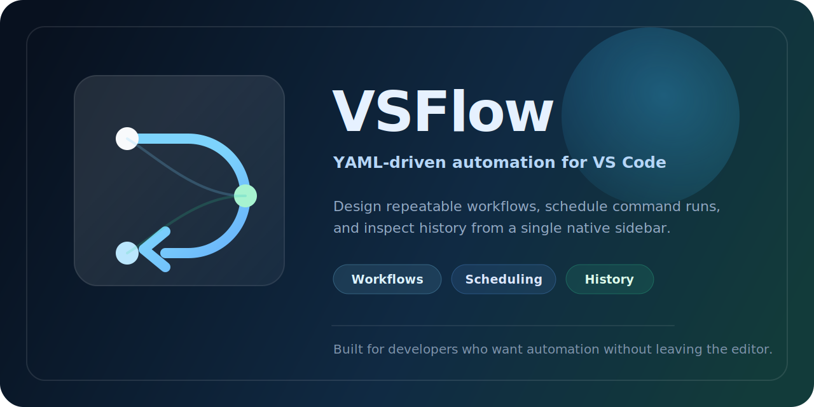
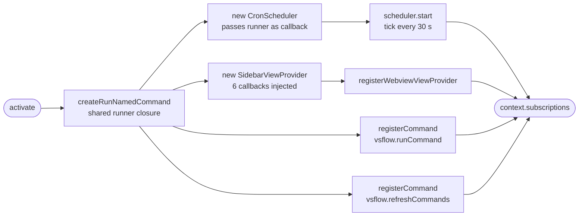
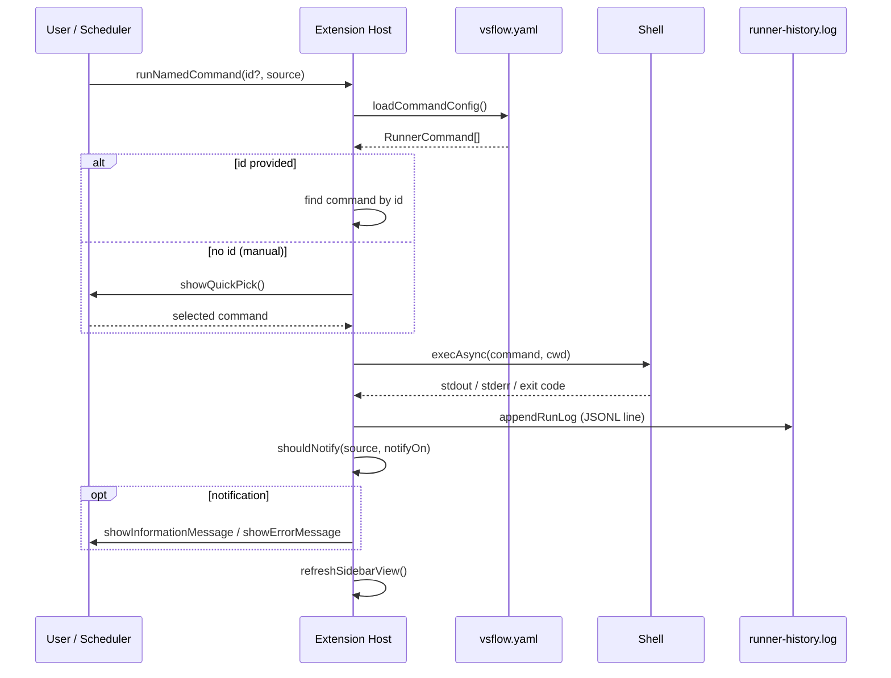
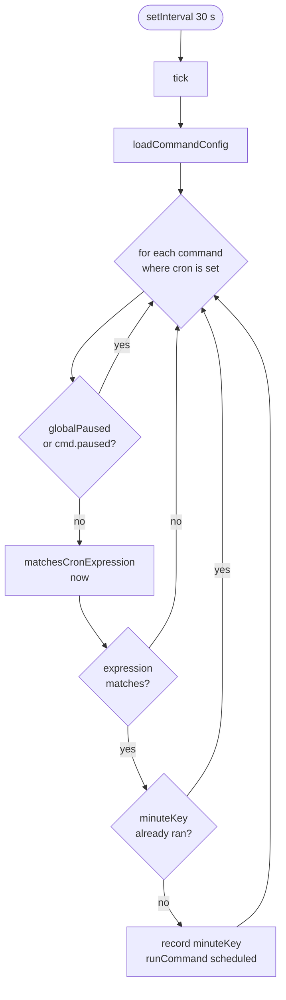
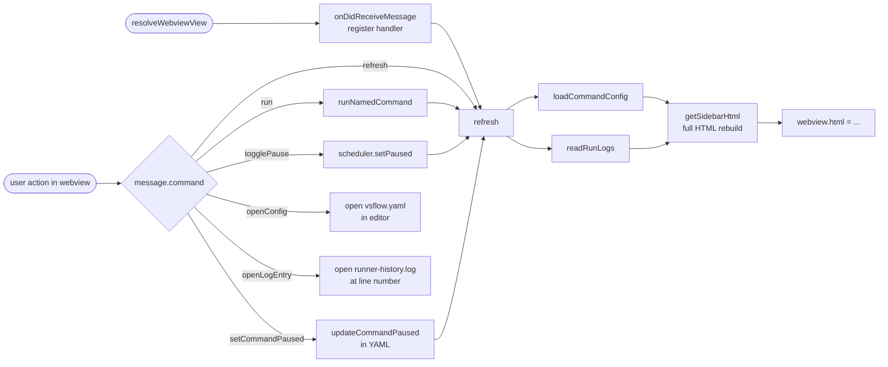

<p align="center">
  
</p>

<p align="center">
  
</p>

<h1 align="center">VSFlow</h1>

<p align="center">
  YAML-driven task automation for VS Code — define shell commands and multi-step workflows, schedule them with cron, and track every run from a built-in sidebar panel.
</p>

<p align="center">
  <a href="https://github.com/rahrajlat/vsflow/actions/workflows/ci.yml"></a>
  <a href="https://marketplace.visualstudio.com/items?itemName=rahrajlat.vsflow"></a>
  <a href="LICENSE"></a>
</p>

---

## Features

- **YAML-first config** — everything lives in a `vsflow.yaml` file at your workspace root; no GUI setup needed.
- **Workflows** — compose shell steps in `sequence` or `parallel` modes, with unlimited nesting.
- **Cron scheduling** — attach any 5-field cron expression to a command and VSFlow fires it automatically inside VS Code.
- **On-save triggers** — attach a glob pattern via `onSave` and the command fires whenever a matching file is saved.
- **Per-command pause** — suspend a scheduled/on-save command without deleting its trigger; paused state persists back into your YAML.
- **Global scheduler toggle** — one click pauses every scheduled command from the sidebar.
- **Run history** — every execution appends a JSONL line to `runner-history.log` with status, stdout/stderr, and timestamp.
- **Configurable notifications** — choose `always`, `failure`, `success`, or `never` per command.
- **Zero runtime dependencies** — pure TypeScript with a hand-written YAML parser; nothing to install beyond VS Code.

---

## Requirements

| Requirement | Version |
|---|---|
| VS Code | ≥ 1.85 |
| Workspace folder | at least one must be open |

---

## Installation

**From the VS Code Marketplace:**

1. Open the Extensions panel (`⇧⌘X` / `Ctrl+Shift+X`)
2. Search for **VSFlow**
3. Click **Install**

**From a VSIX (local build):**

```bash
npm install
npx vsce package        # produces vsflow-*.vsix
code --install-extension vsflow-*.vsix
```

---

## Quick Start

**1. Create `vsflow.yaml` in your workspace root:**

```yaml
commands:
  - title: Hello World
    command: echo "Hello from VSFlow!"
    notifyOn: always
```

**2. Open the VSFlow sidebar** via the Activity Bar icon (or run `VSFlow: Refresh Workspace Commands` from the command palette).

**3. Click ▶** on the card to run the command. The output appears in a VS Code notification and is saved to `runner-history.log`.

---

## YAML Reference

### Top-level structure

```yaml
commands:
  - <command-or-workflow>
  - <command-or-workflow>
```

### Shell command fields

| Field | Type | Required | Description |
|---|---|---|---|
| `title` | string | **yes** | Display name shown in the sidebar and notifications |
| `command` | string | **yes** (for commands) | Shell command to execute |
| `id` | string | no | Stable identifier; auto-derived from `title` if omitted |
| `description` | string | no | Subtitle shown in the sidebar card |
| `cwd` | string | no | Working directory relative to workspace root |
| `cron` | string | no | 5-field cron expression (`* * * * *`) |
| `onSave` | string | no | Glob pattern — fires the command whenever a matching file is saved |
| `paused` | boolean | no | Suspend cron/onSave execution without removing the trigger |
| `notifyOn` | enum | no | `always` · `failure` · `success` · `never` |

### Workflow fields

A command becomes a **workflow** when it has a `steps` list instead of a `command` string.

| Field | Type | Required | Description |
|---|---|---|---|
| `title` | string | **yes** | Display name |
| `mode` | `sequence` \| `parallel` | **yes** (for workflows) | Run steps in order or all at once |
| `steps` | list | **yes** (for workflows) | Child tasks (each can be a command or nested workflow) |
| `id`, `description`, `cwd`, `cron`, `paused`, `notifyOn` | — | no | Same as above |

### Notification defaults

| Run source | Default `notifyOn` |
|---|---|
| Manual (button / palette) | `always` |
| Scheduled (cron) | `failure` |

### Cron syntax

VSFlow uses standard 5-field cron with no seconds field:

```
┌───── minute      (0–59)
│ ┌─── hour        (0–23)
│ │ ┌─ day-of-month (1–31)
│ │ │ ┌ month       (1–12)
│ │ │ │ ┌ day-of-week (0–6, Sun=0)
│ │ │ │ │
* * * * *
```

The scheduler ticks every 30 seconds and deduplicates within the same minute.

### Full example

```yaml
commands:
  # Simple shell command, runs every minute, only notify on failure
  - id: git-pull
    title: Git Pull
    description: Pull latest from origin
    command: git pull
    cron: "* * * * *"
    notifyOn: failure

  # Sequence workflow (steps run one after another)
  - id: dev-check
    title: Dev Check
    description: Install and compile in sequence
    mode: sequence
    steps:
      - title: Install Dependencies
        command: npm install
      - title: Compile TypeScript
        command: npm run compile

  # Nested workflow (parallel inside sequence)
  - id: build-and-pull
    title: Build and Pull
    mode: sequence
    steps:
      - title: Parallel Phase
        mode: parallel
        steps:
          - title: TypeScript Build
            command: npm run compile
          - title: Pull Latest
            command: git pull
      - title: Run Tests
        command: npm test

  # Scheduled compile, alert only on success
  - id: nightly-build
    title: Nightly Build
    command: npm run compile
    cron: "0 2 * * *"
    notifyOn: success

  # Run ESLint whenever a TypeScript file is saved
  - id: lint-on-save
    title: Lint on Save
    command: npx eslint src --ext .ts
    onSave: "src/**/*.ts"
    notifyOn: failure
```

---

## Examples

Ready-to-copy YAML files are in the [`examples/`](examples/) folder:

| File | What it shows |
|---|---|
| [simple.yaml](examples/simple.yaml) | Minimal commands, `id`, `description`, `cwd`, all `notifyOn` values |
| [workflows.yaml](examples/workflows.yaml) | Sequence, parallel, nested parallel-in-sequence, and multi-pipeline patterns |
| [scheduled.yaml](examples/scheduled.yaml) | Common cron expressions — every minute, hourly, daily, weekdays, nightly, paused |
| [on-save.yaml](examples/on-save.yaml) | Glob patterns for `.ts`, `.tsx`, `.json`, `.md`, `.css`, a single file, and combined `onSave` + `cron` |
| [fullstack.yaml](examples/fullstack.yaml) | Realistic Next.js project combining on-save linting, manual dev commands, scheduled pulls, and a full nightly CI workflow |

Copy the file that best matches your stack to your workspace root and rename it `vsflow.yaml`.

---

## How It Works

### Activation flow

When VS Code loads the extension it wires up all components and starts the scheduler:



### Command execution flow

Triggered by the sidebar play button, the command palette, the cron scheduler, or an `onSave` file-save event:



### Scheduler loop

A single `setInterval(30_000)` drives all cron runs. Per-minute deduplication prevents double-firing:



### Sidebar rendering



---

## Commands

| Command | Palette title | Description |
|---|---|---|
| `vsflow.runCommand` | VSFlow: Run Workspace Command | Pick a command from a quick-pick list and run it |
| `vsflow.refreshCommands` | VSFlow: Refresh Workspace Commands | Reload the sidebar from `vsflow.yaml` |

---

## Run Log

Every execution appends one JSON line to `runner-history.log` in your workspace root:

```jsonc
{
  "time": "2024-03-15T10:30:00.000Z",
  "id": "git-pull",
  "title": "Git Pull",
  "command": "git pull",
  "status": "success",        // "success" | "failed"
  "error": "N/A",
  "output": "Already up to date."
}
```

Click a colored run-dot in the sidebar to jump directly to that line in the log file.

---

## Architecture

```
src/
├── extension.ts              Main entry — wires all components, registers commands
├── config/
│   └── commandConfig.ts      YAML loader, hand-written parser, paused-flag writer
├── execution/
│   └── commandRunner.ts      Shell executor, workflow orchestrator, notification logic
├── logging/
│   └── runLogStore.ts        JSONL append and read
├── scheduling/
│   └── scheduler.ts          CronScheduler — setInterval tick, cron matching, dedup
├── ui/
│   ├── sidebarHtml.ts        Full HTML/CSS/JS string renderer for the webview
│   └── sidebarViewProvider.ts  WebviewViewProvider — bridges webview messages to host
└── workspace/
    └── workspaceHelpers.ts   openConfig, openLogEntry, setCommandPaused
```

**Key design decisions:**

- **Dependency injection via callbacks** — `SidebarViewProvider` receives six typed callbacks in its constructor rather than importing extension modules. This decouples the UI layer from host logic and makes both independently testable.
- **Full HTML regeneration** — every `refresh()` rebuilds the entire webview HTML string. Simpler than incremental DOM diffing; acceptable since refreshes are infrequent.
- **No third-party YAML parser** — a purpose-built recursive-descent parser handles only the extension's constrained key set, keeping the runtime dependency tree empty.
- **JSONL append-only log** — logs travel with the workspace (committed or gitignored by the user's choice) and require no migration across extension updates.
- **CSP nonce** — the webview HTML uses a per-render random nonce and `default-src 'none'` to prevent script injection.

---

## License

[MIT](LICENSE) © rahrajlat
